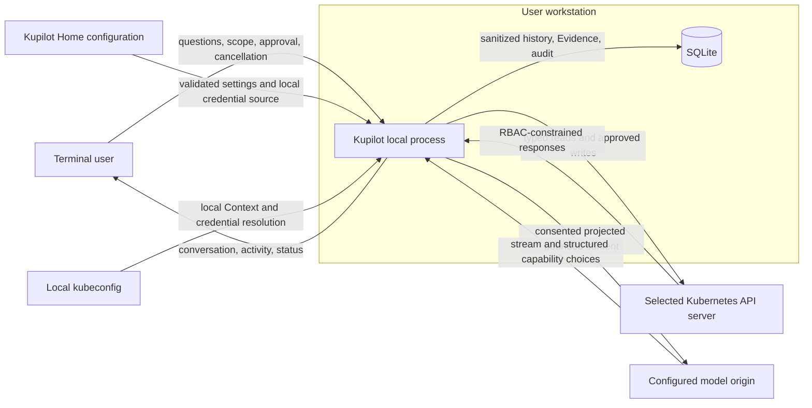
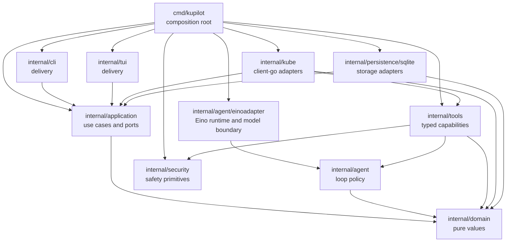
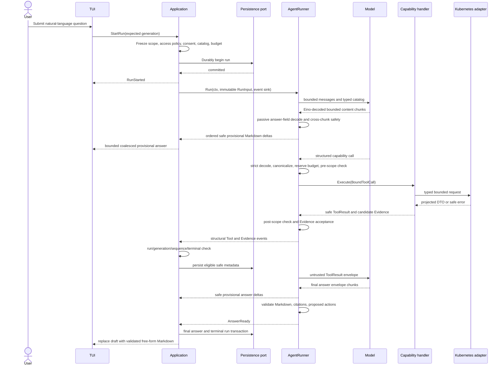

# Kupilot Architecture

Status: Accepted architecture baseline for Kupilot `v0.4`.

This document is normative for package ownership, dependency direction, scope
and run isolation, capability dispatch, action approval, data ownership, and
adapter contracts. The [Product Contract](product.md) and [Scope](scope.md)
define the admitted behavior.

## 1. Architectural invariants

1. `internal/domain` contains only project-owned values, transitions, and
   invariants. It performs no I/O and imports no delivery, persistence, Eino,
   client-go, or database package.
2. `internal/application` is the only use-case layer. It owns Session, run,
   scope, cancellation, persistence intent, event acceptance, consent, status,
   and action-approval orchestration.
3. `cmd/kupilot` is the only composition root. It constructs concrete
   dependencies explicitly and owns startup and shutdown order.
4. `internal/cli` and `internal/tui` are delivery adapters. They use only typed
   Application commands, queries, DTOs, and events. Bubble Tea `Update` and
   `View` perform no business I/O.
5. `internal/agent/einoadapter` is the sole Eino, model-provider, and model
   transport boundary. Vendor message, stream, callback, Tool, HTTP, and error
   types do not escape it.
6. `internal/tools` owns strict capability handlers and the narrow Kubernetes
   ports each handler consumes. A handler does not receive a generic client,
   REST request builder, GVR, selector, repository, or executor.
7. `internal/kube` owns client-go and kubeconfig behavior. No client-go object,
   `rest.Config`, credential, or raw response crosses its adapter boundary.
8. `internal/persistence/sqlite` owns SQL and database handles. SQL rows,
   transactions, sqlx values, and `db` tags remain inside that adapter.
9. Every AgentRun has one immutable RunInput: run identity, verified
   ClusterScope, working Namespace, namespace-access policy, optional resource,
   consent snapshot, capability catalog version, and budget profile.
10. Scope generation is checked before each external capability call, after
    every return, and when Application accepts the event. Cancellation is not
    the sole stale-work defense.
11. Runtime, not prompt text, authorizes capabilities, arguments, Namespace
    reach, budgets, Evidence, actions, approval, and execution.
12. Only deterministic local capability handling creates Evidence. Model prose
    and user text cannot create an observation or execution result.
13. Every mutation is a separate typed transaction with digest-bound approval,
    target revalidation, durable pre-operation audit, one execution attempt,
    and distinct verification.
14. Interfaces are consumer-owned, task-specific, and normally contain one to
    three operations. No generic repository, event bus, Kubernetes gateway,
    service locator, or speculative extension point is admitted.

## 2. System context



Kupilot has no operated server, account, telemetry backend, listener, or remote
control plane. "Local" describes orchestration and credential ownership, not
where the configured model runs. The model has no direct Kubernetes, SQLite,
filesystem, shell, approval, or executor connection.

The TUI starts with one cleared full-height primary-terminal frame and keeps the
composer anchored at the bottom. A delivery-only Bubble Tea runtime wrapper
first removes each newly immutable terminal-safe history block from the live
projection, shrinks and settles that frame, and then inserts history in batches
no taller than the protected area above it. Each block owns exactly one inert
trailing separator row. It acknowledges the block only after insertion. This
prevents transient Tool, Working, answer, or layout spacer rows from being
pushed into scrollback while keeping submitted history separate from Working
and `Worked for` separate from the composer. A terminal without one protected
insertion row keeps the block in the safe live and pending projection. Mouse
reporting remains disabled, so native selection, copy, wheel, and trackpad
scrolling belong to the terminal emulator. The retained bounded transcript
supports keyboard review. This delivery projection is independent of SQLite
Message commitment and explicit Session resume.

Shutdown may print a prepared block only before its first insertion batch. Once
insertion has begun, renderer completion is ambiguous during interruption, so
the runtime never replays the entire block and risks duplicating rows already
owned by terminal scrollback.

The composer publishes a real terminal cursor at the textarea insertion point;
the placeholder remains separate rendered content. This gives operating-system
input methods a stable candidate-window anchor without adding another editor.
While a run is active, a TUI-only timer schedules animation frames for the
`Working` row. Each frame carries the run ID, scope generation, sequence, and
terminal snapshot and is discarded when stale. It changes no Application time,
budget, progress, Evidence, scope, approval, or cancellation authority.

## 3. Dependency direction



An adapter may import the consumer contract it implements. A consumer never
imports the concrete adapter. In particular, TUI and CLI do not call model,
Kubernetes, Tool, persistence, approval-service, or executor implementations.

### Layer responsibilities

<!-- markdownlint-disable MD013 -->

| Layer | Owns | Must not own |
| --- | --- | --- |
| Domain | Values, enums, validation, transitions, stable safe classes | I/O, frameworks, clients, SQL, UI state |
| Application | Session/run/scope use cases, consent, event ordering, `/status`, persistence intent, approval coordination | SDK calls, SQL, terminal rendering, Kubernetes projection |
| Agent | Single-Agent loop, immutable policy, model and capability contracts, Evidence-reference validation | Live scope mutation, client-go, SQLite, TUI state, executor calls |
| Tools | Strict schemas, canonical arguments, projected results, Evidence construction | Generic Kubernetes access, repositories, TUI, approval authority |
| Infrastructure | Kubeconfig and client lifecycle, typed Kubernetes calls, model transport, storage mappings | End-to-end product decisions or policy widening |
| Delivery | CLI intent, Bubble Tea state, rendering, keyboard input, completed terminal transcript projection | Business I/O or authorization |
| Composition | Concrete construction and lifecycle | Hidden globals, policy dispatch, service lookup |

<!-- markdownlint-enable MD013 -->

## 4. Question-to-answer flow



The model/Tool middle segment repeats within the run's frozen budget. Calls are
serial unless a later Accepted decision defines an owned parallel coordinator
and global budget. The provisional projector does not interpret response
modality or create authority. A requested Tool clears text projected from that
pre-Tool turn. No partial stream is promoted to a final assistant Message,
Evidence, action, persistence record, log, audit event, export, or terminal
scrollback entry.

If persistence fails before durable run start, model and Kubernetes call counts
remain zero. A later read-side persistence failure may let the in-memory answer
finish with visible degraded state; it is not claimed resumable. A pre-write
storage or audit failure always produces zero executor calls.

## 5. Scope and namespace-access isolation

`ClusterScope` contains:

| Field | Meaning |
| --- | --- |
| Context | Verified kubeconfig Context name for the selected API server |
| Working Namespace | Verified default Namespace and persistent UI context |
| Namespace access | Frozen `current` or `all` policy |
| Generation | Process-local monotonic stale-work epoch |
| Activated at | UTC activation time |

The Context and working Namespace remain immutable for a run. `all` does not
replace ClusterScope with a global mutable scope; it authorizes an explicit
per-call namespaced target in the same Context. Canonical arguments record the
actual Namespace or the explicit all-Namespace marker. `current` rejects any
other target before Kubernetes I/O.

Cluster-scoped Namespace, Node, and PersistentVolume resources have an empty
resource Namespace by definition. Evidence separately retains the run's
ClusterScope and the exact ResourceRef, so no fake namespaced provenance is
created.

A Context, working-Namespace, or namespace-policy change follows this order:

1. validate the expected generation and candidate;
2. increment generation and mark scope unavailable or activating;
3. cancel and join the active run;
4. clear selected resource, completion caches, and approval state;
5. dispose or rebuild the client as required;
6. verify and publish the new scope, or remain unavailable at the new
   generation.

Every run-scoped external call must pass:

1. a complete scope and generation check before reservation and I/O;
2. the same check after every success, partial, and error return; and
3. Application's run ID, generation, monotonic sequence, and terminal-state
   event acceptance check.

## 6. Capability catalog and Kubernetes boundary

The catalog is code-owned and versioned per run. It may evolve across releases
but never through runtime registration. The initial `v0.4` read entries are
`get_resource`, `list_resources`, `get_cluster_overview`, `get_events`,
`get_pod_logs`, `get_previous_pod_logs`, and `get_related_resources`.

A model-visible schema may contain an explicit Namespace where the capability
needs one. It never contains Context, access policy, kubeconfig, endpoint,
credential, arbitrary API type, raw selector, request method, pagination token,
deadline, or hard ceiling. Runtime injects those authority values into a
`BoundToolCall` after strict decoding and canonicalization.

The direct built-in source allowlist is defined in [Scope](scope.md). Kubernetes
adapters use the matching typed client-go interface. There is no dynamic client,
REST client, raw request builder, discovery fallback, Watch, or informer in the
Agent path.

The local source pipeline is ordered:

1. source and operation allowlist;
2. namespace-access authorization;
3. project-owned projection;
4. text normalization and terminal-control removal;
5. sensitive-value block or typed redaction;
6. item and byte limits;
7. neutral serialization;
8. final consent and model-origin check.

Secret objects and data, ConfigMap values, environment values, Node addresses,
provider identifiers, credential-shaped fields, raw objects, and unlisted APIs
do not become Tool output. Redaction never turns an unlisted source into an
allowed source.

## 7. Runtime budgets and status

RunInput contains the immutable compact, balanced, or extended profile from
ADR-0039. A `RunBudget` atomically reserves steps, model calls, Tool calls, log
calls, result bytes, and repeated-call state before I/O. Child deadlines are the
minimum of the per-request profile value and remaining run time.

The hard ceilings are 30 minutes, 128 steps, 256 Tool calls, 64 model calls,
300-second model requests, 60-second Kubernetes requests, 16 MiB cumulative
Tool results, 32 log calls, and 10 no-progress steps. Per-result and
capability-specific limits remain independent.

`/status` combines an Application-owned read-only query over in-memory safe
state with the TUI's bounded configured model display name. It shows Session,
model name, Context, working Namespace, generation, namespace-access policy,
capability catalog, supervised action availability, privacy and storage state,
budget profile, elapsed/remaining time, and counters. It performs no model,
Kubernetes, Tool, or executor call and does not expose credentials, model
authorization, or raw content.

## 8. Free-form answer and Evidence model

The final protocol envelope contains bounded `answer_markdown`,
`evidence_citations`, and `proposed_actions`.

- Markdown is the visible answer and receives no mandatory local headings.
- An Evidence citation binds a bounded claim to one or more accepted current-run
  Evidence IDs.
- A proposed action contains only a code-defined operation name and its strict
  safe proposal fields. It has no approval or executor authority.

Runtime removes invalid and duplicate citations and records warnings. It does
not claim semantic proof of arbitrary prose. The Evidence registry remains the
source of accepted observations and observation time windows.

The prompt places `answer_markdown` first. The Eino boundary may pass its
already decoded content chunks through an authority-free incremental JSON
string projector. Exact model-credential checks, cross-chunk sensitive-value
recognition, terminal normalization, byte and event ceilings, and current-scope
checks happen before each provisional event. Application provides immediate
first output plus bounded byte- and time-based coalescing. The TUI
renders that draft in the active Agent entry and replaces it with the validated
terminal answer.

`Diagnosis` remains the durable name for the validated terminal result to avoid
an unnecessary migration of every storage concept. Its current semantic core is
the answer Markdown, Evidence citations, proposed actions, validation warnings,
scope, time window, and creation time. Legacy four-collection rows may be read
for compatibility but are not required or rendered for new answers.

## 9. Action and approval boundary

A model cannot call a Kubernetes mutation adapter. A proposed action crosses
into Application as typed intent, where the operation coordinator prepares an
exact target and opens approval.

For `restart_deployment`:

1. Application resolves one exact selected or explicitly proposed Deployment
   in the authorized Namespace and reads its UID, generation, and Pod-template
   fingerprint.
2. The approval service creates a 60-second single-use request and versioned
   digest over operation, policy, run, Session, scope, target, parameters, and
   expiry.
3. Persistence commits the request and audit before TUI visibility.
4. The default-reject TUI returns the request ID, displayed digest, decision,
   and Application-issued nonce.
5. Application rechecks time, nonce, digest, state, scope, and policy.
6. The Kubernetes adapter re-reads and revalidates the target.
7. Persistence atomically records consumed approval and pre-operation audit.
8. A final scope check precedes at most one fixed write with a fresh concurrency
   precondition.
9. API acceptance and bounded rollout verification are separate events.

Expiry, cancellation, replay, restart, scope change, target change, conflict,
audit failure, or ambiguous prior outcome fails closed and never causes an
automatic write retry.

## 10. Core data ownership

<!-- markdownlint-disable MD013 -->

| Value | Essential safe data | Authority rule |
| --- | --- | --- |
| Session | ID, title, privacy mode, timestamps, optional saved scope/resource candidates | History only; resume restores no live authority |
| ClusterScope | Context, working Namespace, access policy, generation, activation time | Application-owned immutable run authority |
| ResourceRef | API version, Kind, actual Namespace when namespaced, name, optional UID/version | Identity only, never an object body |
| AgentRun | IDs, frozen scope/policy/profile, counters, status, times, safe reason | One Application-owned terminal transition |
| ToolInvocation | versioned name, canonical safe arguments, injected scope, status, summary, limits | Model syntax alone is not authorization |
| ToolResult | ephemeral typed data, Evidence, warnings, truncation, safe error | Never persisted as a generic result body |
| Evidence | IDs, run/invocation, exact ResourceRef, run scope, fact, source, time, safety metadata | Created only by deterministic local handling |
| Diagnosis | Markdown, citations, proposed actions, warnings, observed window | Model draft becomes valid only after local checks |
| Approval | digest-bound operation, target, state, expiry, nonce hash | Local single-use authority; model and TUI cannot mint it |
| AuditEvent | typed safe metadata and correlation | Not an arbitrary log or tamper-resistance claim |

<!-- markdownlint-enable MD013 -->

## 11. Consumer-owned ports and concurrency

Representative contracts are:

```text
AgentRunner.Run(ctx, immutable RunInput, RunEventSink)
    -> validated Diagnosis or classified terminal error

Tool.Execute(ctx, BoundToolCall)
    -> safe ToolResult

ResourceReader.<task>(ctx, typed request)
    -> projected DTO or classified error

StatusQuery.CurrentStatus()
    -> bounded in-memory UIStatusResult

ApprovalCoordinator.Decide(ctx, typed decision)
    -> typed approval/execution state
```

No contract returns `any`, `map[string]any`, client-go objects, Eino values,
Bubble Tea messages, SQL rows, DB handles, raw errors, or credentials.

Application owns the sole run goroutine, cancellation function, and join path.
The Eino boundary owns model stream and HTTP response-body closure. The
producer or sole coordinator owns channel closure. Every goroutine has one
owner, cancellation path, and bounded termination path. Tests use barriers,
fake clocks, and channels rather than long sleeps.

The Eino boundary resolves response modality after Eino assembles one bounded
assistant message. Commentary that precedes or accompanies an indexed Tool
selection is discarded only when the same response terminates with
`tool_calls`; only complete calls that pass the project-owned strict binder can
reach runtime dispatch. Valid `stop` text becomes a Diagnosis draft, while
`length` becomes a local budget stop. Tool calls completed with either finish
reason remain invalid.

The passive provisional projector does not alter that ownership. It does not
decode SSE, assemble Eino messages or Tool arguments, or decide a finish reason.
If a response later resolves to `tool_calls`, the first requested Tool event
clears any final-envelope-shaped prose projected from that turn. Failure,
cancellation, timeout, and stale scope replace visible provisional text with a
safe terminal state.

## 12. Persistence and retention

SQLite stores only the explicit safe fields admitted by the Data Retention
Contract. It never stores kubeconfig, credentials, raw Kubernetes objects, raw
Events or logs, full prompts, raw model traffic, raw ToolResult bodies, vendor
errors, framework objects, or generic payload maps.

Standard persistence may retain committed user and final assistant Messages,
the validated Diagnosis, safe invocation metadata, Evidence, model-request
metadata, audit, and approval records for their specified periods. Minimal mode
retains only mandatory lifecycle and write-audit metadata. Resume restores safe
history and unverified candidates, never a running Agent, stream, client,
generation, approval, or action.

## 13. Security and conformance requirements

Required deterministic checks include:

1. static import and composition-root boundaries;
2. strict schema, duplicate/unknown/wrong-type/oversize rejection;
3. exact Kubernetes verbs, resources, API groups, Namespaces, subresources,
   limits, and projections for every admitted source;
4. zero external calls for Secret, ConfigMap-data, unknown API,
   policy-disallowed Namespace, stale scope, malformed call, exhausted budget,
   missing consent, and unapproved action paths;
5. pre-, post-, and event-acceptance generation races;
6. free-form Markdown, citation, action-proposal, terminal-control, sensitive
   output, persistence, and historic compatibility cases, including fragmented
   provisional answers, cancellation, timeout, stale scope, event ceilings,
   Tool-turn clearing, and final replacement;
7. compact, balanced, extended, and hard-ceiling budget tests with fake clocks;
8. approval mismatch, expiry, replay, target-change, pre-audit failure,
   ambiguous outcome, and verification-state tests;
9. dark, light, ANSI-16, and `NO_COLOR` TUI goldens, real-cursor Unicode input,
   correlated Working-frame rejection, primary-screen history insertion and
   live-frame cleanup, disabled mouse reporting, one-editor, and local
   `/status` zero-I/O checks;
   and
10. temporary-file SQLite migration, retention, deletion, and degraded-storage
    tests.

## 14. Decision references

- [ADR-0012: Require Digest-Bound Approval for Writes](adr/0012-require-digest-bound-write-approval.md)
- [ADR-0013: Use Layered Boundaries and Consumer-Owned Ports](adr/0013-layered-architecture-and-consumer-owned-ports.md)
- [ADR-0014: Isolate Runs with ClusterScope Generation](adr/0014-cluster-scope-generation-isolation.md)
- [ADR-0017: Do Not Persist Full Prompts or Raw Outputs](adr/0017-do-not-persist-full-prompts-or-raw-outputs.md)
- [ADR-0020: Contain Kubeconfig Exec Credentials](adr/0020-contain-kubeconfig-exec-credentials.md)
- [ADR-0026: Require Informed Consent Before Model Transfer](adr/0026-require-informed-consent-before-model-transfer.md)
- [ADR-0031: Require Explicit CLI Session Resume](adr/0031-require-explicit-cli-session-resume.md)
- [ADR-0037: Adopt an Operational Capability Catalog](adr/0037-adopt-an-operational-capability-catalog.md)
- [ADR-0038: Use Free-Form Answers with Verified Evidence Metadata](adr/0038-use-free-form-answers-with-verified-evidence-metadata.md)
- [ADR-0039: Use Configurable Runtime Budget Profiles](adr/0039-use-configurable-runtime-budget-profiles.md)
- [ADR-0040: Use a Codex-Style Conversational TUI](adr/0040-use-a-codex-style-conversational-tui.md)
- [ADR-0043: Use One Eino Runtime Boundary](adr/0043-use-one-eino-runtime-boundary.md)
