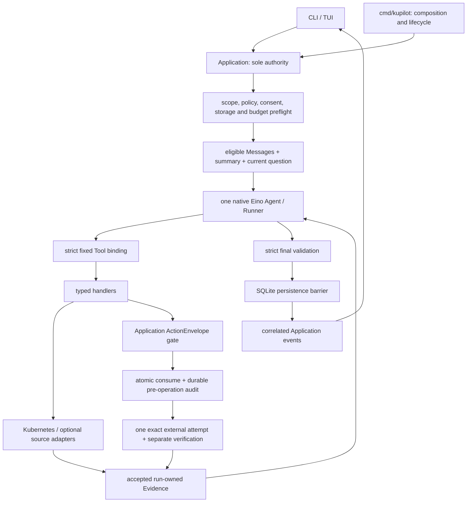

# Kupilot Architecture

Kupilot v0.1.0 is local, single-process and single-user, with one active run and
one verified Kubernetes Context. This document owns package boundaries and the
execution path. [Product](product.md) and [Scope](scope.md) own capability
admission; the [current ADRs](adr/README.md) record design rationale.

## Composition and dependency direction

| Package | Ownership |
| --- | --- |
| cmd/kupilot | Sole composition root; explicit construction and startup/shutdown |
| internal/domain | Pure project values, transitions and invariants; no I/O or vendor types |
| internal/application | Sole use-case and execution authority; Session/run, generations, consent, queue, persistence barriers, Eino and action orchestration |
| internal/agent | Concrete catalog, budgets, Evidence registry and answer-validation rules |
| internal/cli, internal/tui | Typed Application commands/events and delivery projection; no business I/O in Update/View |
| internal/tools | Strict handlers and exact consumer-owned capability ports |
| internal/kube | client-go, kubeconfig, typed projections and exact execution ports |
| internal/observability | Explicit bounded Prometheus/Loki adapters |
| internal/executor | Policy-selected local process lifecycle and bounded output |
| internal/approval, internal/audit, internal/session | Concrete lifecycle values and narrow services used by Application |
| internal/persistence/sqlite | Explicit SQL, mappings, short transactions and the sole durable database |
| internal/persistence/filesystem | Safe bounded export publication |
| internal/platform, internal/security, internal/config | Host lifecycle, build identity, safe logging, filtering and strict configuration |

Interfaces are consumer-owned and task-specific, usually one to three operations.
Keep concrete project DTOs across boundaries. No generic repository, event bus,
service locator, framework-neutral Agent facade or second memory framework exists.
Eino/provider types stay in Application; client-go types stay in Kubernetes;
sqlx/SQL/rows/transactions stay in SQLite. Credentials remain opaque or confined
to the adapter that needs them.

## Core call path

The graph describes authority, not a second orchestration loop. Eino owns native
message state, Tool pairing, ReAct iteration and events. Application owns every
admission, acceptance and commit decision.

## Startup, Session and scope

help, version and cache clear exit before business initialization. Normal startup
loads strict version-1 configuration and opaque role credentials, resolves one
Home and constructs exact adapters.

Bare startup creates a new Session without querying history. Explicit resume
loads only eligible local safe history and unverified scope/resource candidates;
it performs zero model, Kubernetes, Tool, Reviewer or executor I/O. Verify a
candidate independently before an operational question.

A run freezes Session/run identity, complete scope and namespace-access policy,
scope and policy generations, permission profile, role/origin/category consent,
catalog, mode and finite budgets. Context/Namespace changes advance scope
generation first. Permission/catalog/rule/origin-policy changes advance policy
generation and invalidate dependent authority first. Then cancel and join old
work, clear resources and action state, and dispose/rebuild affected clients.

Check generations before I/O, after return, at Application event acceptance and
before execution. Cancellation alone cannot reject a late result.

## History, invocation and native model state

Application selects one ordered bounded representation of all retained eligible
prior turns. Translate it once and include the current question exactly once.
Coverage, consent, generation, storage or budget failure causes zero model calls;
there is no current-question-only fallback.

Standard mode uses the safe SQLite Messages and summary. Minimal mode keeps model
context only in process. Eino summarization middleware uses the agent profile
with an independently reserved, non-streaming, Tool-free, one-attempt budget.
Summary coverage binds exact ordered Message identities and a digest; the tail
remains eligible Message rows. Required compaction failure preserves committed
state and sends no oversized or silently truncated request.

OpenAI Chat Completions streams. Native Responses uses Generate because the pinned
stable component loses encrypted reasoning during streaming. Reviewer and summary
calls are non-streaming and Tool-free. Preserve explicit reasoning and sampling.
Disable SDK retries, response storage, automatic response caching and truncation.
Reasoning items stay bounded, current-run-only and same-origin; they never enter
TUI, logs, SQLite, exports or resumed history.

The narrow HTTP guard enforces canonical origin, credential isolation, request/
response bounds, deadlines and closure. It does not rewrite Tool schemas or repair
generated arguments. ToolInfo is constructed through Eino's public schema API.

## Tool execution and Evidence

Strict binding rejects unknown, malformed, authority-bearing and sensitive Tool
arguments before handler I/O. The model cannot choose Context, generation, GVR,
continuation token, executable, destination or limits. Policy owns exact sources
and selectors. Lists enforce separate per-page and aggregate ceilings.

Adapters allowlist sources, project reviewed fields, normalize and filter sensitive
values, bound output and serialize neutrally before category/sink consent permits
transfer. Deterministic handling creates Evidence bound to invocation, run, scope,
policy and observation time. Application accepts it only while those identities
remain current. Historic references never become live Evidence authority.

Final validation checks the strict response envelope, safe Markdown, accepted
Evidence references, typed clarification, limitations and unexecuted proposals.
Runtime derives hashes/order/coverage and terminal reasons. Model output cannot
mint success, approval or execution. A valid draft is projected only through the
appropriate persistence and event-acceptance barriers.

## Sensitive operations and action authority

Every sensitive or effectful operation first becomes an immutable digest-bound
ActionEnvelope. Application applies strict schema/canonicalization, hard policy,
deterministic risk/profile routing, fresh target/RBAC or executable validation,
exact decision, nonce/digest/time/policy/scope recheck, atomic consumption with
durable pre-operation audit, final generation check, at most one attempt, outcome
and separate verification/post-audit.

Reviewer recommendations and TUI decisions do not independently authorize an
executor. Pre-operation storage failure means zero attempts. Conflict, timeout,
cancellation, restart or unknown outcome never causes automatic execution retry.
Composite drain binds a fixed complete target plan, with one attempt and durable
outcome per pre-bound mutation.

The approval service retains only live process-local authority. Terminal values
return to Application for persistence and presentation, then leave that map.
Durable identity and atomic consumption prevent replay; terminal records are not
kept as an unbounded in-memory archive.

## Queue, cancellation and delivery

Application owns one process-local queue and mutex for FIFO drain, LIFO edit,
revisions and invalidation. Active Enter claims a steer at a native model boundary;
the persistence barrier must commit it before it becomes model input. Active Tab
queues a successor. Pending/failed/unknown inputs never silently resend.

One completed run group contains an initial user Message, committed steers in
order and a final assistant Message. Queue drafts, plan arms, search, selection,
clipboard state and response handles are not durable.

The run owner controls cancellation and bounded join. Stream/body/process owners
close their resources; the producer or its sole coordinator closes channels.
Late events cannot mutate a terminal run. Async TUI messages validate request/run,
generations, sequence and terminal state. Optional presentation failures preserve
the business outcome and add no external retry.

The TUI has one borderless one-to-eight-row composer. Search, pickers, provenance,
approval and status remain bounded inline supervision. Rendering normalizes
Unicode and strips unsafe terminal controls; no meaning relies on color alone.
Terminal scrollback is an external retention surface.

## Persistence, deletion and verification

SQLite safe Messages are the only durable conversation source. Explicit typed
repositories own safe Session, run, Diagnosis, Evidence, invocation, summary,
consent and action/audit records. Standard and minimal mode follow the exact
[Data Retention Contract](data-retention.md); no raw transcript or generic payload
is admitted.

Last active advances monotonically only on admitted lifecycle writes. Exact and
inactive-batch deletion use bounded snapshots, version/digest checks and one
transaction. Protect active or unproved Sessions and clear UI only after commit.
Export is a version-1 redacted free-form summary without restored authority.

The initial schema is one checksummed migration. Incompatible/corrupt storage
fails closed and is not silently recreated. Post-publication migrations are
forward-only. Credentials, kubeconfig, raw objects/output, model traffic, Reviewer
bytes and framework state are prohibited durable data.

Validation uses static boundaries, request-recording fixtures, synthetic Tools,
real temporary SQLite, barriers/fake clocks, no-call denials, cancellation and
sensitive-data canaries. Full gates and native CI are required for changes;
live model and cluster observations are separate exact-configuration evidence.
See [Agent Runtime](agent-runtime.md), [Security](security.md),
[Storage](storage.md) and [Interaction Conformance](interaction-conformance.md).
