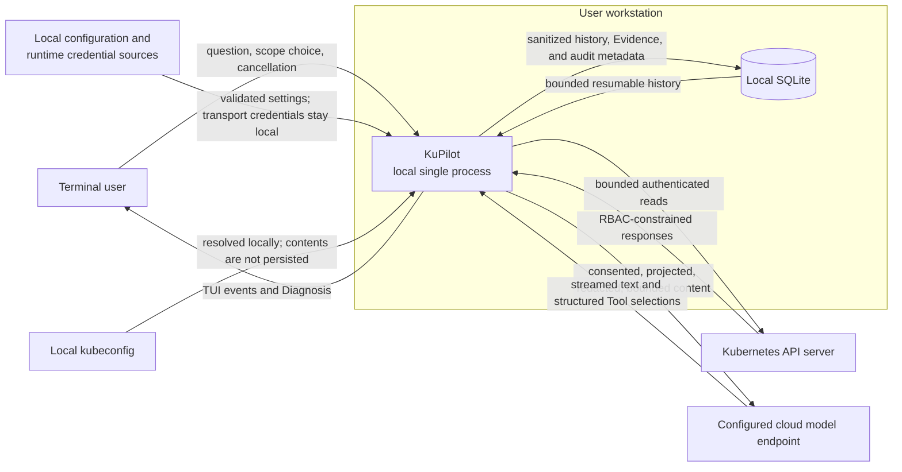
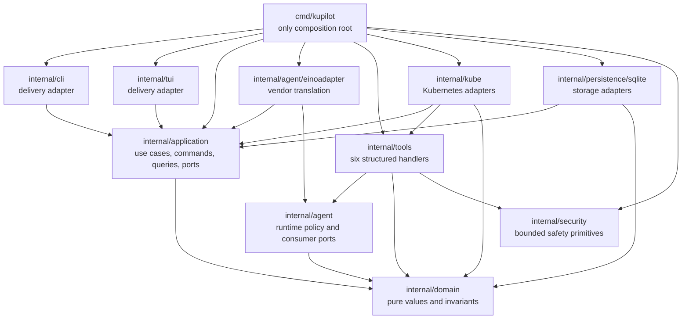
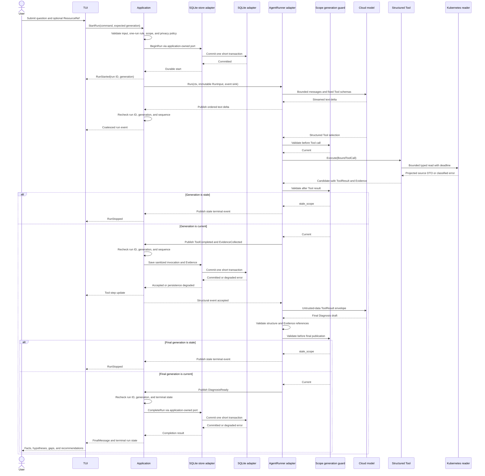
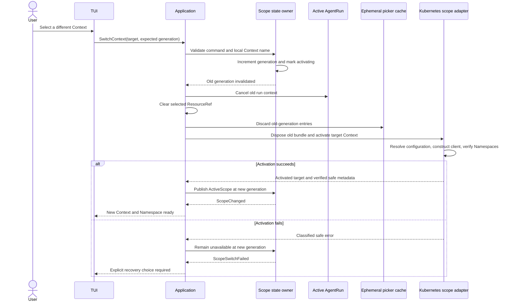
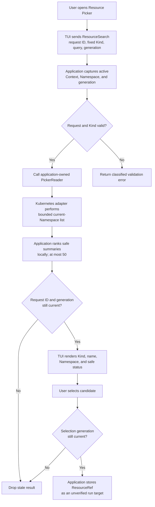
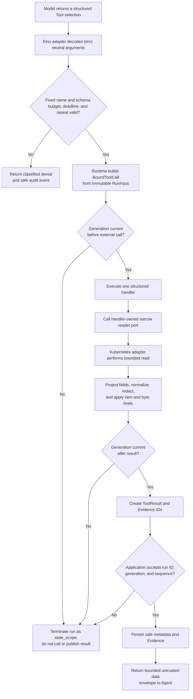
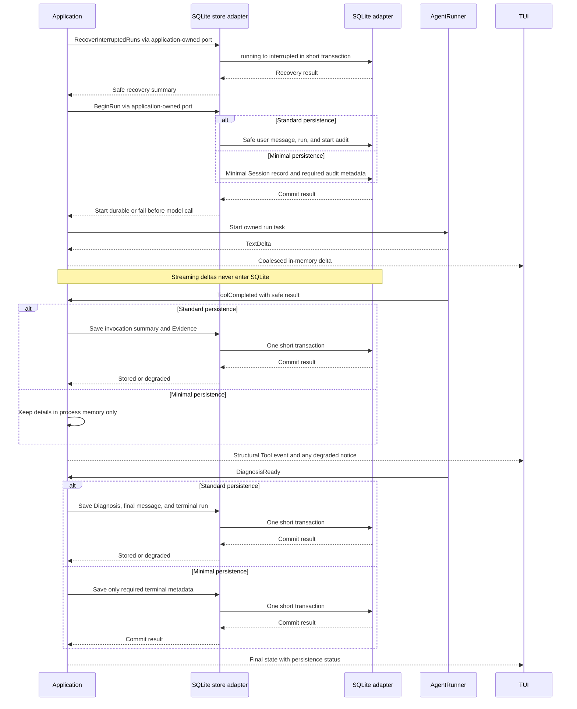
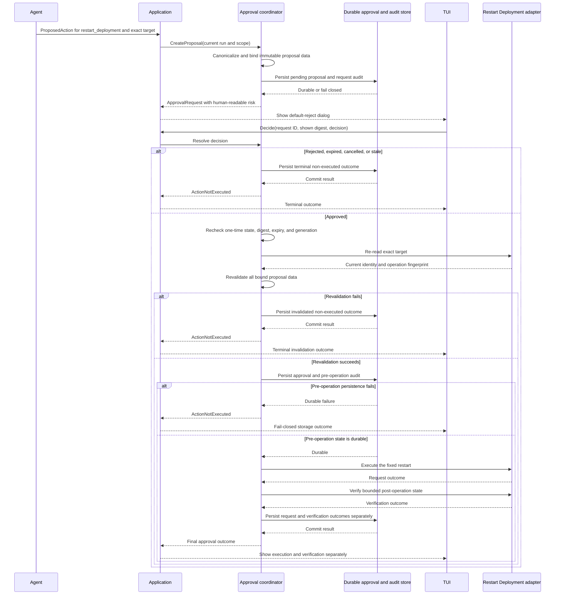

# KuPilot Architecture

Status: Accepted architecture baseline for KuPilot `v0.1`.

This document defines the executable in-process boundaries for KuPilot. It is
normative for package ownership, dependency direction, run and scope isolation,
data ownership, and adapter contracts. Vendor versions and APIs are governed by
their respective dependency decisions.

The product contract remains the authority for product scope. In particular,
`v0.1` is a local, single-process, read-only Kubernetes TUI Agent with one
active AgentRun at a time. The `v0.2` approval boundary documented here is not
part of the `v0.1` composition.

## 1. Architectural invariants

The following rules are mandatory:

1. `internal/domain` contains pure values and invariants. It has no I/O and no
   dependency on Bubble Tea, Eino, client-go, sqlx, a SQLite driver, or any
   vendor protocol type.
2. `internal/application` is the only use-case layer. It owns end-to-end
   orchestration and the contracts through which delivery and infrastructure
   participate.
3. `cmd/kupilot` is the only composition root. It constructs concrete
   adapters explicitly and contains no product policy or use-case logic.
4. Delivery adapters depend on application commands, queries, DTOs, and
   events. The TUI never reads Kubernetes or SQLite directly and never receives
   Eino types.
5. Infrastructure implements consumer-owned ports. A consumer never imports a
   concrete adapter merely to call it.
6. Kubernetes infrastructure does not depend on the Agent runtime. Structured
   Tool handlers do not depend on the TUI, repositories, or SQLite.
7. Eino is isolated inside `internal/agent/einoadapter`. Its message, Tool,
   callback, stream, and error types are translated at that boundary.
8. Every AgentRun receives one immutable RunInput containing one immutable
   ClusterScope. Neither the model nor a ToolInvocation can replace or widen
   that scope.
9. Scope generation is checked before every external Tool call and again after
   the result returns. An application event is checked a third time before it
   can affect persistence, the TUI, or model context.
10. Runtime code enforces scope, Tool allowlists, budgets, data projection,
    redaction, and output limits. Prompt text is behavioral guidance, not an
    authorization or isolation boundary.
11. Confirmed facts can be created only from runtime-generated Evidence for the
    same AgentRun. Model prose cannot create Evidence.
12. Every package and interface has an active use case and a concrete
    responsibility. Empty packages and general frameworks are prohibited.

## 2. System context



KuPilot has no KuPilot-operated server, account system, remote control plane,
or telemetry backend. "Local" describes where orchestration and credentials
live; it does not mean that all diagnostic data remains on the workstation.
Eligible cluster data crosses the model trust boundary only after informed
consent and local safety processing.

The model has no connection to Kubernetes or SQLite. It can select only a Tool
schema exposed for the current run. KuPilot resolves that selection through
runtime policy and a scope-bound local adapter.

## 3. In-process dependency direction

The arrows in this diagram mean compile-time imports. An adapter points toward
the package that owns the port it implements. Runtime calls through those ports
travel from the consumer to the injected implementation; they do not reverse
the compile-time dependency.



The provider-to-consumer imports in the lower half are intentional. For
example, the SQLite adapter may import an application-owned storage port, while
the application package cannot import SQLite. Go's implicit interface
satisfaction should be used when it keeps the same ownership without adding an
adapter-only dependency.

### 3.1 Layer responsibilities

<!-- markdownlint-disable MD013 -->

| Boundary | Owns | Must not own |
| --- | --- | --- |
| Domain | Value objects, state transitions, stable error classes, and invariants | I/O, serialization protocols, framework types, UI state, SQL, clients |
| Application | Session, run, scope, cancellation, persistence intent, event acceptance, and `v0.2` approval orchestration | SDK calls, SQL statements, terminal rendering, Kubernetes object projection |
| Agent core | Single-Agent loop policy, bounded model/Tool contracts, Evidence citation validation, and neutral Agent events | Live scope mutation, Kubernetes clients, SQLite, TUI state |
| Tool handlers | Strict Tool schemas, canonical arguments, Tool budgets, safe ToolResult and Evidence construction | TUI behavior, repository calls, generic Kubernetes access, scope selection |
| Infrastructure | Kubeconfig/client lifecycle, bounded Kubernetes reads, model transport, SQLite mappings, configuration, and safety implementations | End-to-end use-case decisions or policy bypasses |
| Delivery | Typed CLI intent, Bubble Tea state, rendering, input, and conversion between application events and UI messages | Business I/O, repository queries, model or cluster clients |
| Composition root | Concrete construction, configuration validation, ownership wiring, startup, and shutdown order | Product decisions, hidden globals, service lookup, runtime dispatch policy |

<!-- markdownlint-enable MD013 -->

### 3.2 Forbidden dependency edges

These edges are prohibited even if they appear convenient:

- Domain to any external framework, SDK, database, delivery, or infrastructure
  package.
- Application to Bubble Tea, Eino, client-go, sqlx, a SQLite driver, or a
  concrete infrastructure package.
- TUI or CLI to Kubernetes, model, Tool implementation, or persistence
  packages.
- Kubernetes infrastructure to Agent, Eino, TUI, or persistence packages.
- Tool handlers to TUI, application orchestration, repository, persistence, or
  Eino packages.
- Agent runtime to Kubernetes, SQLite, TUI, or concrete repositories.
- Persistence to Agent, Tool, Kubernetes, or TUI packages.
- Any package other than `cmd/kupilot` acting as a composition root.

There is no generic `Repository[T]`, service locator, reflection-based injector,
global mutable registry, generic event bus, or generic Kubernetes client port.
Interfaces normally contain one to three operations and use task-specific
types.

## 4. Runtime call chains

The six flows in this section are the required operational paths. Every
cross-layer arrow names a consumer-owned contract or an application event.

### 4.1 User question to final Diagnosis



Application owns the run task and its cancellation function. The call to
`AgentRunner` is asynchronous from the TUI's perspective, but only one run task
exists. Model requests and Tool calls are serial in `v0.1`, including when a
model response contains multiple Tool selections. The bounded model/Tool middle
segment repeats as needed until the Agent has a final draft or reaches a runtime
limit.

No stale result becomes accepted Evidence. A stale result is not persisted,
shown as a successful Tool step, sent to the model, or reused by another run.
Cancellation, timeout, and classified failure paths publish exactly one
terminal event. Application rechecks its identity, persists the safe terminal
state according to privacy mode, and never promotes a partial model stream to a
final assistant Message.

### 4.2 Context switch



The old client is never silently restored after a failed Context activation.
The user may explicitly select the old Context again, which creates another
generation.

A Namespace candidate can be verified with the current Context before the
commit point while new run submissions are serialized behind the switch
command. A failed precondition leaves the current scope unchanged. A successful
Namespace switch increments generation, cancels the active run, clears the
selected resource and caches, and publishes a new immutable ClusterScope. In
`v0.2`, any committed scope switch invalidates pending approval state at the
same point.

### 4.3 Resource Picker



The Picker uses only Pod, Deployment, ReplicaSet, Job, and Service candidates
in the active Namespace. It has no Watch, informer, cross-Namespace query,
object body cache, or action menu. Selecting a ResourceRef does not create
Evidence and does not prove that the resource exists; a run must verify it
through a Tool.

### 4.4 Tool Calling



The strict model-visible schema contains no Context, Namespace, kubeconfig
location, endpoint, credential, arbitrary resource type, raw selector, deadline,
or hard output limit. Unknown fields are rejected. Scope is copied only from
RunInput when the runtime creates BoundToolCall.

The six `v0.1` Tool names are `get_resource`, `list_resources`, `get_events`,
`get_pod_logs`, `get_previous_pod_logs`, and `get_related_resources`. The Tool
catalog is frozen per run. Configuration may tighten runtime limits but cannot
expand the code-defined maxima.

#### 4.4.1 Frozen runtime budgets

Runtime atomically reserves the following maximums. The model cannot change
them, and configuration can only tighten them.

<!-- markdownlint-disable MD013 -->

| Budget | Maximum |
| --- | --- |
| AgentRun wall clock | 90 seconds |
| One Kubernetes request | 10 seconds |
| One model request | 45 seconds |
| Agent loop | 8 steps, 10 Tool calls, and 3 model requests |
| Repeated call | The same Tool name and canonical arguments at most twice; the second call requires a retryable error or explicit state revalidation |
| ToolResult bytes | 64 KiB per result and 384 KiB cumulative per run |
| Result items | 50 resources, 50 Events, and 100 Evidence items per result |
| Log reads | 200 tail lines, a 15-minute window, 64 KiB per result, and 2 log calls per run |
| Related resources | 2 hops, 25 nodes, and 40 edges |
| No-progress stop | Stop collection after 2 consecutive Agent steps produce no new Evidence |

<!-- markdownlint-enable MD013 -->

Reaching a limit produces a partial result or a safe terminal Diagnosis with an
explicit gap. It never causes a limit increase or a broader scope.

### 4.5 Persistence



Application owns transaction intent; the SQLite adapter owns SQL and concrete
transaction mechanics. No transaction remains open across a model request,
Kubernetes request, user interaction, or stream. A failure to persist the run
start prevents the model call. A later read-only history failure may allow the
in-memory Diagnosis to finish, but Application marks the run as persistence
degraded and makes that state visible.

SQLite stores neither framework objects nor raw transport bodies. Raw
Kubernetes objects, raw log bytes, assembled prompts, stream deltas, and raw
Tool results are not durable data. Resume loads a safe conversation container;
it never resumes an Eino loop, ToolInvocation, client, cancellation function,
or old generation.

### 4.6 Approval boundary (`v0.2` only)

`v0.1` constructs no approval or mutation adapter. The following boundary
applies only to `v0.2`, whose sole admitted operation is `restart_deployment`
for one exact Deployment.



An approval authorizes one immutable digest, not a category of similar actions.
Any scope generation, operation, target identity, fingerprint, or canonical
parameter mismatch invalidates it. Durable pre-operation audit is required; a
storage failure prevents the external operation.

## 5. Scope and run isolation

### 5.1 ClusterScope

ClusterScope is a pure immutable value with exactly these semantic fields:

| Field | Meaning |
| --- | --- |
| `context_name` | Verified kubeconfig Context display name |
| `namespace` | Verified Namespace for all namespaced `v0.1` operations |
| `generation` | Process-local, monotonically increasing scope epoch |
| `activated_at` | UTC activation time |

It contains no client, server address, transport credential, kubeconfig path,
cancellation function, mutable cache, or framework value. A persisted
generation is diagnostic metadata only. Process startup establishes a new live
epoch; persisted values can never reactivate access.

Generation is an invalidation mechanism, not an authorization mechanism.
Kubernetes authentication, RBAC, fixed Kind and relationship allowlists, and
runtime budgets remain independent controls.

### 5.2 Immutable RunInput

Application creates RunInput only after validating the user command, active
scope, one-run invariant, and privacy policy. It contains:

- Run and Session identifiers.
- The validated and locally redacted user question.
- One ClusterScope value copied from active scope state.
- Zero or one ResourceRef copied from the user's current selection.
- A frozen RunBudget, Tool catalog version, prompt version, and privacy/transfer
  policy snapshot.

RunInput contains no live client, repository, mutable application state,
framework message, callback, or credential. Construction canonicalizes values
and defensively copies all collection storage. Accessors must not return mutable
aliases. Once `AgentRunner.Run` starts, neither Application nor the runner
mutates RunInput.

Changing Context, Namespace, selected resource, privacy categories, or hard
policy creates a new value for a future run. It never edits the active run.

### 5.3 Generation invalidation protocol

For each run-scoped external call, the runtime follows this order:

1. Compare the run's complete ClusterScope and generation with the current
   active scope immediately before budget reservation and adapter invocation.
2. If stale, return `stale_scope` without invoking the external adapter. Tests
   must assert an external call count of zero.
3. Bind the current run scope internally and execute with the run context and a
   shorter child deadline.
4. Compare scope and generation again after the adapter returns, including
   error and partial-result paths.
5. If stale, discard the candidate result before persistence, model transfer,
   successful TUI publication, or Evidence acceptance.
6. Application checks `run_id`, generation, monotonic sequence, and terminal
   state when consuming every asynchronous event. A late or duplicate event is
   rejected even if an upstream adapter missed cancellation.

Cancellation improves responsiveness but is not sufficient for isolation.
Both generation checks and the application acceptance check are required.

## 6. Core data model

These are domain and application contract shapes, not database rows or complete
Go declarations. Identifiers are opaque application-generated text. Times are
UTC. Optional fields distinguish unknown from a legitimate zero value.

### 6.1 Session and Message

<!-- markdownlint-disable MD013 -->

| Model | Essential data | Invariants |
| --- | --- | --- |
| Session | ID, title, status, timestamps, last-scope candidate, selected-resource candidate, privacy mode, optional safe summary, version | A Session is conversation history, not live scope or execution state. Bare startup creates a new Session. Saved scope and resource values require explicit activation and verification. |
| Message | ID, Session ID, optional run ID, neutral role, bounded content, format, scope snapshot, optional ResourceRef, status, created time | Roles are project-owned values, not vendor enums. Only committed user and final assistant content is eligible for standard persistence. |

<!-- markdownlint-enable MD013 -->

Session never contains a client, credential, cancellation function, working
directory association, or persisted live generation. Minimal-persistence
Sessions do not retain resumable message content across processes.

### 6.2 ResourceRef

ResourceRef contains an allowlisted API version and Kind, Namespace, name, and
optional UID and resource version. It never contains an object body, label map,
annotation map, or client-go value.

A selected ResourceRef is an unverified requested target. A Tool read may
strengthen it with UID and resource version; only the resulting Evidence can
support a confirmed fact.

### 6.3 AgentRun

AgentRun contains its ID, Session ID, request Message ID, immutable ClusterScope
and ResourceRef snapshot, counters, timing, normalized termination reason,
optional Diagnosis ID, and `persistence_degraded` state.

SQLite stores the request identity independently from its optional retained
Message relationship. Standard mode binds that relationship to the committed
request Message. Minimal mode leaves it absent, so interruption recovery keeps
an opaque correlation identity without creating a Message row or retaining its
content.

Allowed states are:

```text
queued -> running -> completed
                  -> failed
                  -> cancelled
                  -> timed_out
                  -> stale_scope
                  -> interrupted
```

Only Application transitions run state, and only once into a terminal state.
Startup recovery may change a durably recorded `running` state to `interrupted`;
it never continues the execution.

### 6.4 ToolInvocation and ToolResult

ToolInvocation records the run ID, sequence, fixed Tool name and schema version,
bounded purpose, injected scope, canonical sanitized arguments and digest,
status, timestamps, safe error classification, safe summary, and truncation
metadata. Model-supplied scope is never part of canonical arguments.

ToolResult is an ephemeral safe envelope containing invocation identity, Tool
name and version, scope, observation time, success/partial/error/denied status,
a Tool-specific DTO, Evidence, warnings, truncation metadata, and a classified
safe error. A full ToolResult is not a persistence row. Only the required safe
summary, normalized metadata, and accepted Evidence are durable.

### 6.5 Evidence

Evidence contains:

- Evidence ID, run ID, and ToolInvocation ID.
- Category, ResourceRef, concise observed fact, and safe source path.
- ClusterScope, observation time, and optional resource version.
- Deterministic severity when available, redaction and truncation metadata, and
  a normalization fingerprint.

Only deterministic local Tool handling creates Evidence IDs. Evidence describes
an observation, not an inference. It is accepted only after the post-result
generation check and application event check. Evidence from a different run or
generation is history and cannot support a current confirmed fact.

### 6.6 Diagnosis

Diagnosis contains its ID, run ID, observed scope and time window, creation time,
validation warnings, and four distinct collections:

<!-- markdownlint-disable MD013 -->

| Collection | Required contract |
| --- | --- |
| Confirmed facts | Every statement references one or more accepted Evidence IDs from the same run. |
| Hypotheses | Each statement remains an inference and may include supporting Evidence, bounded confidence, and a falsifier. |
| Missing information | Records unavailable, forbidden, unsupported, stale, conflicting, or truncated observations and their impact. |
| Recommended actions | Describes user-evaluated next steps, risks, and prerequisites without representing them as performed. |

<!-- markdownlint-enable MD013 -->

The Agent adapter treats model output as a draft. It validates structure and
references against the runtime Evidence set. An unsupported fact is removed or
demoted to a hypothesis and produces a validation warning.

### 6.7 AuditEvent

AuditEvent contains an ID, optional Session and run IDs, stable event type, UTC
time, safe scope snapshot, actor, optional ResourceRef, outcome, correlation ID,
and allowlisted redacted details. It is structured audit data, not an arbitrary
log entry and not a claim of tamper resistance.

### 6.8 `v0.2` ApprovalRequest and ApprovalDecision

These models are inactive in `v0.1`. A `v0.2` ApprovalRequest binds an ID, run
and Session, fixed operation, immutable scope and generation, exact target
identity, canonical parameters, operation digest, human and risk summaries,
one-time state, policy version, and expiry. ApprovalDecision binds the displayed
digest, approve or reject choice, local user actor, decision time, and one-time
UI nonce. Neither model contains an arbitrary operation payload.

### 6.9 ModelConfiguration

ModelConfiguration is a validated, serializable configuration value rather
than a vendor SDK object. It contains the fixed provider kind
`openai_compatible`, endpoint origin, configured model identifier, API-key
source category, bounded temperature and output settings, request timeout,
required streaming and Tool-calling capabilities, and transport policy.

The API key itself is a runtime transport credential and is not a
ModelConfiguration field. The value also contains no HTTP client, Eino model,
request headers, redirect callback, or raw endpoint response. Model adapters
must validate endpoint capabilities before use and keep SDK mappings behind the
adapter boundary.

## 7. Consumer-owned ports

A port is owned by the package that needs the capability. Concrete adapters are
injected by `cmd/kupilot`. The ports below are minimal, task-specific contracts;
their names do not authorize broader method sets.

<!-- markdownlint-disable MD013 -->

| Runtime call | Contract owner | Typical implementation | Contract boundary |
| --- | --- | --- | --- |
| CLI or TUI to use case | `application` | Application coordinator | Typed command/query in, neutral DTO or event out; no delivery types |
| Application to Agent | `application` (`AgentRunner`) | `agent/einoadapter` | Immutable RunInput, neutral RunEventSink, Diagnosis, classified error |
| Agent runtime to scope freshness | `application` (`RunScopeGuard`) | Application scope state owner | Exact run scope in; current or `stale_scope` out; no client or credential crosses |
| Application to scope activation | `application` (`ScopeActivator`) | `kube` | Context/Namespace candidate in; verified safe scope metadata or classified error out |
| Application to Picker reads | `application` (`PickerReader`) | `kube` | Fixed Kind/query/scope/limit in; safe bounded candidate DTOs out |
| Application to Session discovery | `application` (`SessionSearchReader`) | `persistence/sqlite` | Bounded literal filter over safe title, timestamp, and display-only scope metadata; stable projected candidates out |
| Application to durable history | `application` (focused Session, run, Evidence, and audit store ports) | `persistence/sqlite` | Transaction intent and domain values; no SQL, row, DB, or Tx type crosses inward |
| Application to Session export snapshot | `application` (`SessionExportReader`) | `persistence/sqlite` | One consistent versioned allowlist source projection; no generic entity serialization or raw source field crosses inward |
| Application to summary file publication | `application` (`ExportFileWriter`) | `persistence/filesystem` | Explicit target plus final bounded Markdown bytes; filesystem and path types remain in the adapter |
| Agent runtime to model | `agent` (`Model`) | Eino-backed model adapter | Neutral messages, fixed Tool specifications, stream events; no vendor types escape |
| Agent runtime to Tool | `agent` (`Tool`) | `tools` handlers | Fixed specification plus BoundToolCall; returns safe ToolResult |
| Tool handler to Kubernetes read | `tools` (`ResourceReader`) | `kube` | Task-specific bounded read request and projected DTO; no generic request surface |
| Consumer to redaction/output safety | Nearest consumer, normally `agent`, `tools`, or logging | `security` implementation | Small task-specific operation; reports redaction or block outcome |
| Application to TUI | `application` event contract | TUI event adapter | Run ID, generation, sequence, UTC time, and neutral payload converted to UI message |
| Application to `v0.2` approval | `application` (`ApprovalCoordinator`) | Approval service | Proposal or decision in; immutable request or terminal outcome out; `v0.2` only |
| `v0.2` approval to durable state | Approval consumer (`ApprovalStore` and `AuditAppender`) | `persistence/sqlite` | Digest-bound state and allowlisted audit fields; durable pre-operation failure closes the path |
| `v0.2` approval to external operation | Approval consumer (`RestartDeploymentExecutor`) | `kube` adapter | One revalidated Deployment restart and exact target; absent from `v0.1` composition |

<!-- markdownlint-enable MD013 -->

Conceptual contract shapes are:

```text
AgentRunner.Run(ctx, immutable RunInput, RunEventSink)
    -> Diagnosis or classified error

Tool.Execute(ctx, BoundToolCall)
    -> safe ToolResult

ResourceReader.<task-specific read>(ctx, bound request)
    -> projected DTO or classified error

RunEventSink.Publish(ctx, ordered neutral event)
    -> accepted, degraded, or rejected
```

No contract returns `any`, a generic map, a client-go object, an Eino value, a
Bubble Tea message, a SQL row, or a database handle. A concrete type is preferred
when no isolation or test seam is needed.

## 8. Synchronous and asynchronous boundaries

<!-- markdownlint-disable MD013 -->

| Boundary | Mode and owner | Ordering, cancellation, and backpressure |
| --- | --- | --- |
| CLI/TUI command to Application | Synchronous validation and acceptance; Application owns the use case | Commands carry an expected generation or request ID where stale work is possible. Long I/O does not run in Bubble Tea `Update` or `View`. |
| Application to AgentRunner | One Application-owned asynchronous task per active run | One parent context owns model streams and Tool calls. Application cancels and waits during shutdown. |
| AgentRunner to model | Streaming external I/O, one request at a time | Child deadline is shorter than run deadline. Stream ownership and closure remain inside the adapter. |
| AgentRunner to Tool | Synchronous result per Tool selection, serial in `v0.1` | Pre-call and post-result generation checks surround execution. No Tool starts after cancellation or terminal state. |
| Tool to Kubernetes reader | Synchronous bounded request under a child context | Adapter returns a projected DTO or classified error; response bodies are closed by the adapter owner. |
| Agent events to Application | Ordered asynchronous stream with run ID, generation, and sequence | Text deltas may be coalesced or intermediate render frames dropped. Tool, Evidence, error, and terminal events cannot be dropped. |
| Application to persistence | Short synchronous transaction on an application worker, never a UI update path | Network I/O and user waits never occur inside a transaction. Degraded policy is decided by Application. |
| Application summary export | One serialized Application operation after TUI confirmation | Snapshot read, deterministic projection, content-free audit, and atomic file publication occur outside Bubble Tea `Update` and `View`; an active run and concurrent deletion are denied. |
| Application events to TUI | Asynchronous neutral events converted to Bubble Tea messages | TUI rejects stale request IDs, generations, sequences, and terminal duplicates before rendering. |
| Scope switch | Serialized Application command | New run acceptance is blocked through the switch commit point; generation invalidation and cancellation happen in the defined order. |

<!-- markdownlint-enable MD013 -->

The component that creates the run event stream owns its closure. Tool workers
never close a shared channel. Every goroutine must have one owner, a cancellation
path, and a bounded termination path.

## 9. Persistence ownership and data eligibility

<!-- markdownlint-disable MD013 -->

| Data | In memory | Standard persistence | Minimal persistence |
| --- | --- | --- | --- |
| Active RunInput and live ClusterScope epoch | Required for active run | Safe run scope snapshot and metadata only | Required terminal metadata only |
| User and final assistant Messages | Required | Redacted, bounded content | Not durable |
| Stream deltas | Ephemeral | Never | Never |
| ToolInvocation | Active state and safe result | Canonical sanitized arguments, status, summary, limits, and safe error | Not durable beyond required audit metadata |
| Evidence | Current run set | Accepted safe Evidence with retention policy | Not durable |
| Diagnosis | Current result | Structured result and rendered final message | Not durable |
| Raw Kubernetes or model protocol data | Adapter-local and shortest necessary lifetime | Never | Never |
| AuditEvent | Required event metadata | Allowlisted structured fields | Only required minimal fields |

<!-- markdownlint-enable MD013 -->

Repository interfaces are use-case-specific and consumer-owned. The SQLite
adapter uses explicit schema mappings and fixed queries internally; those are
not domain models. Session resume reconstructs only safe history and candidates,
then requires a new scope activation and a new AgentRun for any question.

Resume discovery uses a typed Application query and a fixed, bounded SQLite
ranking over safe display metadata before the result crosses the adapter
boundary. The TUI continues to use the root composer and the existing picker;
it neither queries SQLite nor creates a second Session-management surface.

Summary export is also Application-owned. Application selects the fixed schema,
applies policy, serializes against deletion, renders the deterministic Markdown,
and persists the path-free audit event. SQLite supplies only the explicit source
allowlist. The narrow filesystem adapter owns path validation, owner-only
permissions, same-directory temporary files, and atomic no-replace publication.
Domain values do not import operating-system or path packages, and the TUI sends
only the typed export command.

## 10. Security boundary summary

- Credentials are transport inputs to local adapters, never model content,
  domain fields, application events, or durable history.
- Fixed source allowlists and projection precede redaction. Redaction lowers
  residual risk but does not expand what may be read.
- External free text is normalized, bounded, and treated as untrusted data.
  Runtime policy, not prompt wording, decides what can execute.
- The model cannot set scope, resource type outside the fixed catalog, deadline,
  output maximum, endpoint, or credentials.
- Generation checks reject stale work before an external call, after its
  result, and at the event consumer.
- Kubernetes RBAC errors, unavailable data, unsupported capabilities, and output
  limits become explicit missing information rather than reasons to broaden
  access.
- The `v0.1` composition contains no approval coordinator or resource mutation
  adapter. Text recommendations do not activate infrastructure.

## 11. Conformance requirements

Conformance with this baseline requires all of the following checks:

1. Import-boundary tests or static checks must enforce the forbidden edges and
   Eino confinement.
2. Race-controlled tests must switch generation before a call and while a call
   is in flight. They must prove zero external calls for the first case and zero
   accepted result sinks for the second.
3. Contract tests must prove that TUI and CLI use only application commands,
   queries, and events.
4. Tool tests must prove strict schemas, runtime scope binding, deterministic
   projection, fixed limits, safe errors, and accepted Evidence provenance.
5. Persistence tests must prove transaction boundaries, startup interruption
   recovery, minimal-persistence behavior, and absence of prohibited raw data.
6. Diagnosis tests must use a deterministic rubric for structure, Evidence
   references, allowed assertions, and forbidden assertions. A live model is
   not a CI oracle.

Concrete dependency versions and vendor API paths are outside this baseline and
require independent validation before adoption.

## 12. Decision references

- [ADR-0001: Use Go](adr/0001-use-go.md)
- [ADR-0002: Use a Local Single Process with No KuPilot Server](adr/0002-local-single-process-no-server.md)
- [ADR-0003: Keep the Product Agent-First](adr/0003-agent-first-interaction.md)
- [ADR-0004: Do Not Fork k9s](adr/0004-do-not-fork-k9s.md)
- [ADR-0013: Use Layered Boundaries and Consumer-Owned Ports](adr/0013-layered-architecture-and-consumer-owned-ports.md)
- [ADR-0014: Isolate Runs with ClusterScope Generation](adr/0014-cluster-scope-generation-isolation.md)
- [ADR-0015: Require the Evidence and Diagnosis Contract](adr/0015-evidence-and-diagnosis-contract.md)

See also the [Product Contract](product.md), [Scope](scope.md),
[Privacy Overview](privacy-overview.md), and [Glossary](glossary.md).
