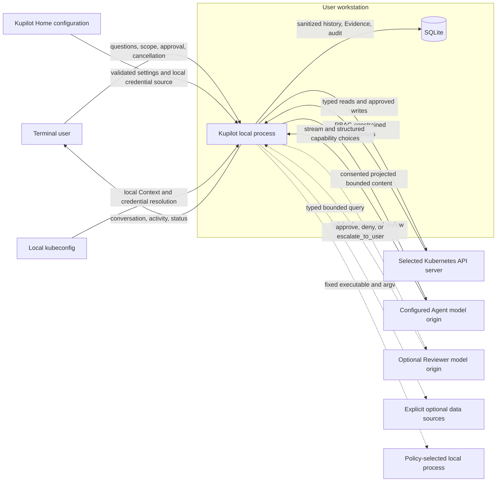
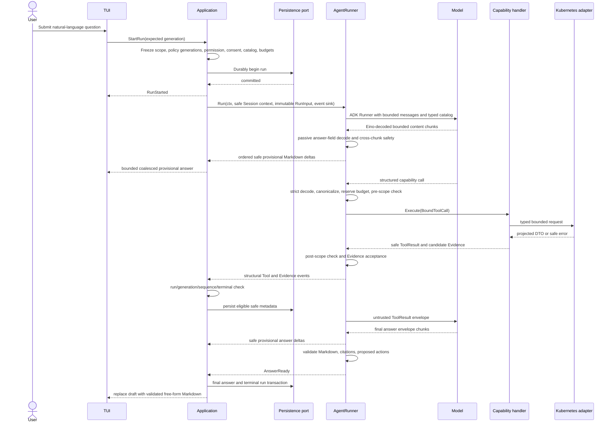

# Kupilot Architecture

Status: Accepted architecture target for Kupilot `v0.5`.

The checked-in implementation now includes the named-model, stable Eino ADK,
role-scoped consent, safe Session-memory/summarization, deterministic
permission routing, common ActionEnvelope/approval lifecycle, and related
budget and status foundations. Only the existing typed Deployment restart is
composed through that lifecycle. The expanded catalog, permission delivery
interactions, optional data sources, and new execution or remediation paths
remain targets; this document does not claim they are reachable.

This document is normative for package ownership, dependency direction, scope
and run isolation, capability dispatch, action approval, data ownership, and
adapter contracts. The [Product Contract](product.md) and [Scope](scope.md)
define the admitted behavior.

## 1. Architectural invariants

1. `internal/domain` contains only project-owned values, transitions, and
   invariants. It performs no I/O and imports no delivery, persistence, Eino,
   client-go, or database package.
2. `internal/application` is the only use-case layer. It owns Session, run,
   scope, cancellation, persistence intent, event acceptance, consent, status,
   and action-approval orchestration.
3. `cmd/kupilot` is the only composition root. It constructs concrete
   dependencies explicitly and owns startup and shutdown order.
4. `internal/cli` and `internal/tui` are delivery adapters. They use only typed
   Application commands, queries, DTOs, and events. Bubble Tea `Update` and
   `View` perform no business I/O.
5. `internal/agent/einoadapter` is the sole Eino, model-provider, and model
   transport boundary. Vendor message, stream, callback, Tool, HTTP, and error
   types do not escape it.
6. `internal/tools` owns strict capability handlers and the narrow Kubernetes
   ports each handler consumes. A handler does not receive a generic client,
   REST request builder, GVR, selector, repository, or executor.
7. `internal/kube` owns client-go and kubeconfig behavior. No client-go object,
   `rest.Config`, credential, or raw response crosses its adapter boundary.
8. `internal/persistence/sqlite` owns SQL and database handles. SQL rows,
   transactions, sqlx values, and `db` tags remain inside that adapter.
9. Every AgentRun has one immutable RunInput: run identity, verified
   ClusterScope, working Namespace, namespace-access policy, scope and policy
   generations, optional resource, role- and origin-bound consent snapshot,
   capability catalog version, permission profile, and capability-aware budget
   profile.
10. Scope and applicable policy generations are checked before each external
    capability call, after every return, when Application accepts the event,
    and immediately before an execution attempt. Cancellation is not the sole
    stale-work defense.
11. Runtime, not prompt text, authorizes capabilities, arguments, Namespace
    reach, budgets, Evidence, actions, approval, and execution.
12. Only deterministic local capability handling creates Evidence. Model prose
    and user text cannot create an observation or execution result.
13. Every sensitive or effectful operation uses an immutable digest-bound
    `ActionEnvelope`, deterministic risk and permission routing, fresh target
    or executable revalidation, durable pre-operation audit, at most one
    execution attempt, and distinct outcome and verification.
14. Interfaces are consumer-owned, task-specific, and normally contain one to
    three operations. No generic repository, event bus, Kubernetes gateway,
    service locator, or speculative extension point is admitted.
15. Stable Eino ADK `ChatModelAgent`, `Runner`, message state, and
    summarization middleware are reused directly inside the one Eino boundary.
    Kupilot owns policy and safe projections, not a parallel ReAct loop,
    `MemoryManager`, summary engine, checkpoint store, or framework facade.
16. The optional model Reviewer is never authority. Application's
    deterministic policy remains the only source of capability, risk, scope,
    approval, execution, and fail-closed decisions.

## 2. System context



Kupilot has no operated server, account, telemetry backend, listener, or remote
control plane. "Local" describes orchestration and credential ownership, not
where configured models or data sources run. Models have no direct Kubernetes,
SQLite, filesystem, shell, approval, or executor connection. Dashed edges are
optional, default-off capability boundaries, not implicit fallbacks.

The TUI starts with one cleared full-height primary-terminal frame and keeps the
composer anchored at the bottom. A delivery-only Bubble Tea runtime wrapper
first removes each newly immutable terminal-safe history block from the live
projection, shrinks and settles that frame, and then inserts history in batches
no taller than the protected area above it. Each block owns exactly one inert
trailing separator row. It acknowledges the block only after insertion. This
prevents transient Tool, Working, answer, or layout spacer rows from being
pushed into scrollback while keeping submitted history separate from Working
and `Worked for` separate from the composer. A terminal without one protected
insertion row keeps the block in the safe live and pending projection. Mouse
reporting remains disabled, so native selection, copy, wheel, and trackpad
scrolling belong to the terminal emulator. The retained bounded transcript
supports keyboard review. This delivery projection is independent of SQLite
Message commitment and explicit Session resume.

Shutdown may print a prepared block only before its first insertion batch. Once
insertion has begun, renderer completion is ambiguous during interruption, so
the runtime never replays the entire block and risks duplicating rows already
owned by terminal scrollback.

The composer publishes a real terminal cursor at the textarea insertion point;
the placeholder remains separate rendered content. This gives operating-system
input methods a stable candidate-window anchor without adding another editor.
While a run is active, a TUI-only timer schedules animation frames for the
`Working` row. Each frame carries the run ID, scope generation, sequence, and
terminal snapshot and is discarded when stale. It changes no Application time,
budget, progress, Evidence, scope, approval, or cancellation authority.

## 3. Dependency direction


An adapter may import the consumer contract it implements. A consumer never
imports the concrete adapter. In particular, TUI and CLI do not call model,
Kubernetes, Tool, persistence, approval-service, or executor implementations.

### Layer responsibilities

<!-- markdownlint-disable MD013 -->

| Layer | Owns | Must not own |
| --- | --- | --- |
| Domain | Values, enums, validation, transitions, stable safe classes | I/O, frameworks, clients, SQL, UI state |
| Application | Session/run/scope use cases, policy generation, permission routing, consent, event ordering, `/status`, persistence intent, approval coordination | SDK calls, SQL, terminal rendering, Kubernetes projection |
| Agent | Immutable run policy, model-role and capability contracts, Evidence-reference validation | A parallel ReAct loop, live scope mutation, client-go, SQLite, TUI state, executor calls |
| Tools | Strict schemas, canonical arguments, projected results, Evidence construction | Generic Kubernetes access, repositories, TUI, approval authority |
| Infrastructure | Kubeconfig and client lifecycle, typed Kubernetes calls, model/data-source/process transport, storage mappings | End-to-end product decisions or policy widening |
| Delivery | CLI intent, Bubble Tea state, rendering, keyboard input, completed terminal transcript projection | Business I/O or authorization |
| Composition | Concrete construction and lifecycle | Hidden globals, policy dispatch, service lookup |

<!-- markdownlint-enable MD013 -->

## 4. Question-to-answer flow



The model/Tool middle segment is owned by Eino ADK `ChatModelAgent` and `Runner`
inside `einoadapter` and repeats within frozen role and capability budgets.
Application selects eligible ordered same-Session context; the adapter converts
it once. Kupilot does not run a parallel conversation or ReAct loop. Calls are
serial unless a later Accepted decision defines an owned bounded coordinator.
The provisional projector does not interpret response modality or create
authority. A requested Tool clears text projected from that pre-Tool turn. No
partial stream is promoted to a final assistant Message, Evidence, action,
persistence record, log, audit event, export, or terminal scrollback entry.

An accepted proposed action enters a separate permission and execution flow.
Application creates an `ActionEnvelope`, classifies risk, routes it under the
frozen profile, obtains any human or Reviewer decision, revalidates, durably
consumes authority and pre-audits, and only then calls an executor at most once.
The Agent and Reviewer never receive the executor.

If persistence fails before durable run start, model and Kubernetes call counts
remain zero. A later read-side persistence failure may let the in-memory answer
finish with visible degraded state; it is not claimed resumable. A pre-write
storage or audit failure always produces zero executor calls.

## 5. Scope and namespace-access isolation

`ClusterScope` contains:

| Field | Meaning |
| --- | --- |
| Context | Verified kubeconfig Context name for the selected API server |
| Working Namespace | Verified default Namespace and persistent UI context |
| Namespace access | Frozen `current` or `all` policy |
| Generation | Process-local monotonic stale-work epoch |
| Activated at | UTC activation time |

The Context and working Namespace remain immutable for a run. `all` does not
replace ClusterScope with a global mutable scope; it authorizes an explicit
per-call namespaced target in the same Context. Canonical arguments record the
actual Namespace or the explicit all-Namespace marker. `current` rejects any
other target before Kubernetes I/O.

Cluster-scoped Namespace, Node, and PersistentVolume resources have an empty
resource Namespace by definition. Evidence separately retains the run's
ClusterScope and the exact ResourceRef, so no fake namespaced provenance is
created.

A Context, working-Namespace, or namespace-policy change follows this order:

1. validate the expected generation and candidate;
2. increment generation and mark scope unavailable or activating;
3. cancel and join the active run;
4. clear selected resource, completion caches, and approval state;
5. dispose or rebuild the client as required;
6. verify and publish the new scope, or remain unavailable at the new
   generation.

Every run-scoped external call must pass:

1. a complete scope and generation check before reservation and I/O;
2. the same check after every success, partial, and error return; and
3. Application's run ID, generation, monotonic sequence, and terminal-state
   event acceptance check.

Permission profile, capability policy, Session rule, relevant data-source
policy, or model-origin policy changes use a separate process-local
`policy_generation`. The change invalidates pending Reviewer decisions,
approvals, Session rules, and ActionEnvelopes before cancelling old work. Any
operation affected by both dimensions must pass both generations at all gates.

## 6. Capability catalog and external boundaries

The catalog is code-owned and versioned per run. It may evolve across releases
but never through runtime registration, model discovery, or a generic API or
process handle. The `v0.5` P0 categories are defined in [Scope](scope.md):
typed built-in and exact policy-admitted CRD reads and bounded queries, Events,
all bounded log modes and local search, Pod/Node metrics, explicit optional
Prometheus/Loki sources, container-file read, Pod diagnostics, diagnostic Pods,
typed remediation, restricted direct local argv, and a separate shell class.

A model-visible schema may contain an explicit Namespace or operation parameter
where the capability needs one. It never contains Context, access policy,
kubeconfig, endpoint, credential, arbitrary API type or GVR, raw selector,
executable, image, network destination, YAML, deadline, or hard ceiling. The
separate default-off shell schema is the only capability that may carry one
exact bounded command string as a typed proposal field. Runtime injects
authority into a bound capability or immutable `ActionEnvelope` only after
strict decoding and canonicalization.

Built-in and exact CRD mappings remain narrow task-specific Kubernetes ports.
A policy-admitted CRD entry names exact group, version, resource, Kind, scope,
verbs, projected fields, limits, and Evidence mapping; discovery cannot expand
it. No client-go object, dynamic client, REST client, request builder, Watch, or
informer crosses the Kubernetes adapter boundary.

List and query handlers use safe server-side filtering where supported, while
runtime owns continuation tokens and bounded pagination. Per-page and aggregate
page, item, byte, and time limits are independent, and incomplete results carry
explicit partial or truncation state. Safe Secret metadata and separately
reviewed exact ConfigMap-key or non-credential environment values use distinct
projected categories; Secret values and generic or bulk values remain denied.

Optional data sources and local processes have their own consumer-owned ports.
They do not reuse a generic network or command interface, select each other as
fallbacks, or bypass the normal data pipeline:

1. source and operation allowlist;
2. scope and policy authorization;
3. project-owned projection;
4. text normalization and terminal-control removal;
5. sensitive-value block or typed redaction;
6. item and byte limits;
7. neutral serialization;
8. final role-, category-, and origin-bound consent check.

Credential values, Secret values, ServiceAccount tokens, kubeconfig, raw
objects, raw external output, and unlisted APIs never become generic Tool,
model, history, log, audit, or SQLite content. Redaction never turns an unlisted
source into an allowed source.

## 7. Runtime budgets, permissions, and status

The current RunInput contains immutable Agent and Agent-summary limits, while
the optional Reviewer has a separate role budget owned by Application.
Reservations are atomic and occur before model I/O, and child deadlines are no
later than the owning operation or run. The accepted later permission and
capability work adds independent data-source, remote/local execution, item,
line, sample, and idle limits.

All budgets remain finite. Exact context windows, input/output tokens, request
and stream limits, summary thresholds, latency, concurrency, and cost ceilings
require evidence for the exact pinned Eino/OpenAI component and selected
endpoint. The earlier `v0.4` global limits are not universal `v0.5` values.
Absent exact token evidence, conservative byte, call, time, and cost ceilings
still fail closed.

The current `/status` combines an Application-owned read-only query over bounded
safe state with TUI display data. It includes Session memory/coverage, named
model roles and origin hashes, consent, scope generation, capability catalog,
Agent/summary/Reviewer budgets, run state, and storage health. Application also
provides content-free local permission-policy, Session-rule, and active-action
status queries. These queries perform no model, Kubernetes, Tool, Reviewer,
process, or executor I/O and expose no credentials or content. The complete
`/permissions` interaction and operation-specific outcome or verification
display remain later delivery work.

## 8. Free-form answer and Evidence model

The final protocol envelope contains bounded `answer_markdown`,
`evidence_citations`, and `proposed_actions`.

- Markdown is the visible answer and receives no mandatory local headings.
- An Evidence citation binds a bounded claim to one or more accepted current-run
  Evidence IDs.
- A proposed action contains only a code-defined operation name and its strict
  safe proposal fields. It has no approval or executor authority.

Runtime removes invalid and duplicate citations and records warnings. It does
not claim semantic proof of arbitrary prose. The Evidence registry remains the
source of accepted observations and observation time windows.

The prompt places `answer_markdown` first. The Eino boundary may pass its
already decoded content chunks through an authority-free incremental JSON
string projector. Exact model-credential checks, cross-chunk sensitive-value
recognition, terminal normalization, byte and event ceilings, and current-scope
checks happen before each provisional event. Application provides immediate
first output plus bounded byte- and time-based coalescing. The TUI
renders that draft in the active Agent entry and replaces it with the validated
terminal answer.

`Diagnosis` remains the durable name for the validated terminal result to avoid
an unnecessary migration of every storage concept. Its current semantic core is
the answer Markdown, Evidence citations, proposed actions, validation warnings,
scope, time window, and creation time. Legacy four-collection rows may be read
for compatibility but are not required or rendered for new answers.

## 9. Permission, ActionEnvelope, and execution boundary

A model or Reviewer cannot call a Kubernetes, data-source, remote-exec, or
local-process executor. A proposed sensitive or effectful operation crosses
into Application as strict typed input. Application canonicalizes one immutable
`ActionEnvelope` containing operation and policy versions, risk and profile,
Session/run/request identity, exact scope and both generations, target identity
and fingerprints, typed parameters or fixed executable plus argv,
stdin/TTY/shell flags, data/sink/network effects, hard limits, expiry, and a
verification plan.

Restricted argv binds only policy-owned executable and argv values. The
separate default-off shell operation may bind one exact bounded command string
as a typed parameter; it is never accepted through an argv fallback.

Application then performs this fixed sequence:

1. strict catalog/schema validation and canonicalization;
2. deterministic capability policy and hard-deny checks;
3. permission-profile routing;
4. fresh target/RBAC or executable-policy validation;
5. exact human approval, permitted Reviewer decision, or matching human
   Session rule;
6. nonce, digest, time, profile, policy, scope, generation, and target recheck;
7. atomic single-use consumption and durable pre-operation audit;
8. final scope and policy-generation check;
9. at most one external execution attempt;
10. accepted, failed, or ambiguous/unknown outcome classification; and
11. separate bounded verification and post-operation audit.

The checked-in foundation implements the closed project-owned action types,
canonical digest, all five deterministic permission profiles, process-local
Session-rule creation/list/revocation APIs, strict Reviewer routing, durable
decision and single-use consumption, final generation checks, and content-free
status. The composition root still enables only the existing typed Deployment
restart executor under the default `ask` profile. Merely naming another
admitted operation in the closed catalog does not enable it, grant RBAC, or
make an executor reachable.

`ask` is the default permission profile. Reviewer delegation applies only to
`review`; `critical` remains human-routed under `ask` and `auto-review`.
`full-access` and exact custom critical-auto rules may omit a per-action prompt
only after explicit high-risk selection and never bypass capability enablement,
RBAC, scope, consent, audit, revalidation, or `deny`.

Expiry, cancellation, replay, restart, generation change, target change,
conflict, audit failure, or ambiguous prior outcome fails closed and never
causes an automatic execution retry. API acceptance, progress, unknown outcome,
and verified completion are distinct events for every operation.

A composite drain remains one envelope execution. Its fixed ordered target set
cannot change after review, every pre-bound mutation has at most one attempt
and its own durable outcome, and any retry requires a fresh envelope.

## 10. Core data ownership

<!-- markdownlint-disable MD013 -->

| Value | Essential safe data | Authority rule |
| --- | --- | --- |
| Session | ID, title, privacy mode, timestamps, optional saved scope/resource candidates | History only; resume restores no live authority |
| ClusterScope | Context, working Namespace, access policy, generation, activation time | Application-owned immutable run authority |
| ResourceRef | API version, Kind, actual Namespace when namespaced, name, optional UID/version | Identity only, never an object body |
| AgentRun | IDs, frozen scope/policy/profile, counters, status, times, safe reason | One Application-owned terminal transition |
| ModelProfile | Name, fixed consumer role, non-secret settings, canonical origin hash, limits | Explicit composition only; no fallback or router |
| SessionContext | Eligible committed message IDs, safe summary and coverage, recent tail | Context only; never restores operational authority |
| ToolInvocation | versioned name, canonical safe arguments, injected scope, status, summary, limits | Model syntax alone is not authorization |
| ToolResult | ephemeral typed data, Evidence, warnings, truncation, safe error | Never persisted as a generic result body |
| Evidence | IDs, run/invocation, exact ResourceRef, run scope, fact, source, time, safety metadata | Created only by deterministic local handling |
| Diagnosis | Markdown, citations, proposed actions, warnings, observed window | Model draft becomes valid only after local checks |
| PermissionPolicy | Profile, risk routing, policy generation, current-process Session rules | Deterministic Application authority; Reviewer cannot widen it |
| ActionEnvelope | Versioned operation, exact scope/target/parameters/effects/limits/verification and digest | Immutable review and execution identity; no generic payload |
| Approval | envelope digest, actor, state, expiry, nonce hash | Local single-use authority; model, Reviewer, and TUI cannot mint it |
| AuditEvent | typed safe metadata and correlation | Not an arbitrary log or tamper-resistance claim |

<!-- markdownlint-enable MD013 -->

## 11. Consumer-owned ports and concurrency

Representative contracts are:

```text
AgentRunner.Run(ctx, safe Session context, immutable RunInput, RunEventSink)
    -> validated Diagnosis or classified terminal error

Tool.Execute(ctx, BoundToolCall)
    -> safe ToolResult

ResourceReader.<task>(ctx, typed request)
    -> projected DTO or classified error

StatusQuery.CurrentStatus()
    -> bounded in-memory UIStatusResult

ApprovalCoordinator.Decide(ctx, typed decision)
    -> typed approval/execution state

PermissionQuery.CurrentPolicy()
    -> bounded in-memory permission state
```

No contract returns `any`, `map[string]any`, client-go objects, Eino values,
Bubble Tea messages, SQL rows, DB handles, raw errors, or credentials.

Application owns the sole run goroutine, cancellation function, and join path.
The Eino boundary owns model stream and HTTP response-body closure. The
producer or sole coordinator owns channel closure. Every goroutine has one
owner, cancellation path, and bounded termination path. Tests use barriers,
fake clocks, and channels rather than long sleeps.

The Eino boundary directly composes stable ADK `ChatModelAgent` and `Runner`,
which own in-run message state, Tool-message pairing, ReAct iteration, and
events. Commentary that precedes or accompanies an indexed Tool selection is
discarded only when the same response terminates with `tool_calls`; only
complete calls that pass the project-owned strict binder can reach runtime
dispatch. Valid `stop` text becomes a Diagnosis draft, while `length` becomes a
local budget stop. Tool calls completed with either finish reason remain
invalid. Kupilot does not add a second conversation loop, memory manager,
summary engine, or framework-neutral runtime facade.

The passive provisional projector does not alter that ownership. It does not
decode SSE, assemble Eino messages or Tool arguments, or decide a finish reason.
If a response later resolves to `tool_calls`, the first requested Tool event
clears any final-envelope-shaped prose projected from that turn. Failure,
cancellation, timeout, and stale scope replace visible provisional text with a
safe terminal state.

## 12. Persistence and retention

SQLite stores only the explicit safe fields admitted by the Data Retention
Contract. It never stores kubeconfig, credentials, raw Kubernetes objects, raw
Events or logs, full prompts, raw model traffic, raw ToolResult bodies, vendor
errors, framework objects, or generic payload maps.

Standard persistence may retain committed user and final assistant Messages,
the validated Diagnosis, safe invocation metadata, Evidence, model-request
metadata, a bounded safe summary and coverage metadata, audit, and action
records for their specified periods. Minimal mode keeps model context only in
the current process and retains only mandatory lifecycle and action-audit
metadata.

For every AgentRun after the first question in a Session, Application supplies
Eino with exactly one ordered, bounded representation of all retained eligible
prior same-Session messages. On the current stable dependency line, existing
SQLite Messages are the only durable source and the adapter bridge performs only
selection, ordering, coverage, and DTO translation. Eino summarization
middleware reuses the `agent` profile with an independent reserved budget.
Runner-managed Session support may replace the bridge only after a stable,
non-prerelease tag passes ADR-0047's storage, authority, consent, retention, and
test gate.

Resume restores safe history and unverified candidates but performs no model,
Kubernetes, Tool, Reviewer, approval, process, or executor I/O. The next
explicit question transmits the required eligible representation only after
current consent, scope, policy, coverage, and budget checks. A failed gate
causes zero model calls rather than a current-question-only fallback. History
never restores a running Agent, stream, client, generation, Evidence authority,
permission rule, Reviewer decision, approval, ActionEnvelope, or execution
state.

## 13. Security and conformance requirements

Required deterministic checks include:

1. static import and composition-root boundaries;
2. strict schema, duplicate/unknown/wrong-type/oversize rejection;
3. exact Kubernetes verbs, resources, API groups, Namespaces, subresources,
   limits, projections, and optional data-source or process requests for every
   admitted source;
4. zero external calls for credentials, Secret values, unknown API or CRD,
   policy-disallowed Namespace, stale scope or policy, malformed call,
   exhausted budget, missing consent, and unapproved action paths;
5. pre-, post-, and event-acceptance generation races;
6. free-form Markdown, citation, action-proposal, terminal-control, sensitive
   output, persistence, and historic compatibility cases, including fragmented
   provisional answers, cancellation, timeout, stale scope, event ceilings,
   Tool-turn clearing, and final replacement;
7. role- and capability-aware profile and hard-ceiling tests with fake clocks;
8. permission-profile and risk routing, Reviewer failure, Session-rule,
   approval mismatch, expiry, replay, target-change, pre-audit failure,
   ambiguous outcome, and verification-state tests;
9. dark, light, ANSI-16, and `NO_COLOR` TUI goldens, real-cursor Unicode input,
   correlated Working-frame rejection, primary-screen history insertion and
   live-frame cleanup, disabled mouse reporting, one-editor, and local
   `/status` zero-I/O checks;
   and
10. temporary-file SQLite migration, summary coverage, explicit resume,
    retention, deletion, export, and degraded-storage tests.

## 14. Decision references

- [ADR-0012: Require Digest-Bound Approval for Writes](adr/0012-require-digest-bound-write-approval.md)
- [ADR-0013: Use Layered Boundaries and Consumer-Owned Ports](adr/0013-layered-architecture-and-consumer-owned-ports.md)
- [ADR-0014: Isolate Runs with ClusterScope Generation](adr/0014-cluster-scope-generation-isolation.md)
- [ADR-0017: Do Not Persist Full Prompts or Raw Outputs](adr/0017-do-not-persist-full-prompts-or-raw-outputs.md)
- [ADR-0020: Contain Kubeconfig Exec Credentials](adr/0020-contain-kubeconfig-exec-credentials.md)
- [ADR-0026: Require Informed Consent Before Model Transfer](adr/0026-require-informed-consent-before-model-transfer.md)
- [ADR-0031: Require Explicit CLI Session Resume](adr/0031-require-explicit-cli-session-resume.md)
- [ADR-0037: Adopt an Operational Capability Catalog](adr/0037-adopt-an-operational-capability-catalog.md)
- [ADR-0038: Use Free-Form Answers with Verified Evidence Metadata](adr/0038-use-free-form-answers-with-verified-evidence-metadata.md)
- [ADR-0039: Use Configurable Runtime Budget Profiles](adr/0039-use-configurable-runtime-budget-profiles.md)
- [ADR-0040: Use a Codex-Style Conversational TUI](adr/0040-use-a-codex-style-conversational-tui.md)
- [ADR-0043: Use One Eino Runtime Boundary](adr/0043-use-one-eino-runtime-boundary.md)
- [ADR-0044: Prioritize Daily Operations and Adopt Permission Profiles](adr/0044-prioritize-daily-operations-and-adopt-permission-profiles.md)
- [ADR-0045: Admit Controlled Execution and Remediation](adr/0045-admit-controlled-execution-and-remediation.md)
- [ADR-0046: Use Named Model Roles and Optional Auto-Review](adr/0046-use-named-model-roles-and-optional-auto-review.md)
- [ADR-0047: Reuse Eino ADK for Session Context and Summarization](adr/0047-reuse-eino-adk-for-session-context-and-summarization.md)
